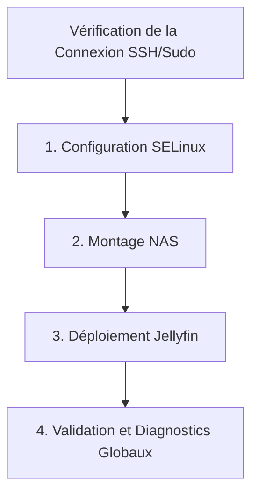

# Guide de Déploiement sur Installation Fraîche Bazzite

Ce guide présente l'ordre logique d'exécution des playbooks Ansible lors d'un premier déploiement sur une installation propre de Bazzite (Fedora Atomic). 

---

## 1. Description de la Structure des Playbooks

Chaque playbook de l'infrastructure remplit un rôle précis et réutilisable :
* **[bazzite_config_selinux.yml](../playbooks/bazzite_config_selinux.yml)** : Configure les règles globales de sécurité SELinux.
* **[mount_nas.yml](../playbooks/mount_nas.yml)** : Configure de manière robuste les points de montage Samba en s'appuyant sur le rôle générique local `nas_mount` et en gérant les pannes réseau via un script d'attente systemd (`wait-for-nas`).
* **[jellyfin.yml](../playbooks/jellyfin.yml)** : Gère le serveur de médias en utilisant un fichier d'unité Podman Quadlet (`.container`) sous le contrôle de l'instance systemd de l'utilisateur.
* **[bazzite_config_test.yml](../playbooks/bazzite_config_test.yml)** : Un outil de diagnostic automatisé vérifiant l'intégration entre Podman, SELinux et les partages Samba.

---

## 2. Ordre de Lancement des Playbooks

Il est critique de suivre l'ordre ci-dessous lors d'un déploiement initial en raison des dépendances matérielles et logicielles.



### Étape Inituelle : Validation de la Connexion et Sudo
Avant de lancer un playbook, vérifiez que le canal de communication SSH et l'authentification sudo fonctionnent.
```bash
# Valider le ping SSH (sans élévation become)
ansible bazzite_hosts -m ping -e "ansible_become=false"

# Valider l'accès privilege et le mot de passe sudo décodé par Vault
ansible bazzite_hosts -m command -a "whoami" -b
```

### Étape 1 : Configuration SELinux (Global)
Configurez en premier les politiques de sécurité du système d'exploitation cible. Sans cette étape, le montage Samba CIFS ou les volumes Podman pourraient être bloqués par SELinux.
```bash
ansible-playbook playbooks/bazzite_config_selinux.yml
```
* **Pourquoi en premier ?** : Ce playbook applique de façon persistante le booléen `httpd_use_cifs` permettant aux services système et conteneurs d'accéder à des partages Samba distants.

### Étape 2 : Montage des Partages NAS
Les partages Samba définis dans la variable `nas_mounts` doivent être montés avant de pouvoir être mappés dans le conteneur Jellyfin. Lancez le playbook de montage :
```bash
ansible-playbook playbooks/mount_nas.yml
```
* **Pourquoi à ce stade ?** : Ce playbook applique de façon itérative le rôle `nas_mount`. Il déploie les identifiants SMB confidentiels dans `/var/home/famille/.smb/credentials` (avec permissions `0600`), génère les scripts d'attente robustes dans `/usr/local/bin/`, et configure les fichiers d'unité systemd `.mount`.

### Étape 3 : Déploiement de Jellyfin
Une fois les volumes réseau Samba opérationnels et montés dans `/var/home/famille/nas/`, vous pouvez déployer le service multimédia :
```bash
ansible-playbook playbooks/jellyfin.yml
```
* **Pourquoi ?** : Ce playbook applique le contexte SELinux `container_file_t` sur les répertoires internes de Bazzite, écrit le template Podman Quadlet `jellyfin.container`, et lance le service systemd de l'utilisateur `famille`. Jellyfin requiert la présence des points de montage créés à l'étape 2.

### Étape 4 : Validation et Diagnostics Globaux
Pour vous assurer que Jellyfin a bien accès en lecture/écriture à ses dossiers locaux et en lecture seule aux dossiers Samba sans être bloqué par SELinux, lancez le playbook de validation :
```bash
ansible-playbook playbooks/bazzite_config_test.yml
```
* **Pourquoi ?** : Ce playbook fait tourner un conteneur léger temporaire (Alpine) simulant le comportement de Jellyfin, et vérifie de manière automatisée que les écritures et lectures locales et Samba se font avec succès.
